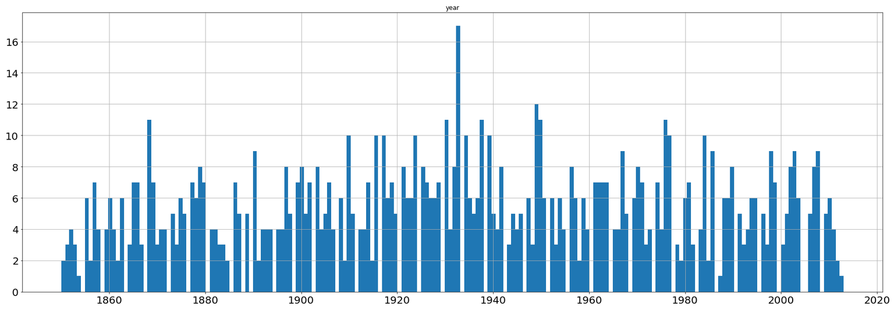

# Análisis de Riesgos para Masas de Meteoritos

## Autor: Jorge Antonio Camarena Pliego

## Metodología

* Preprocesamiento de datos
* Análisis de distribución de los datos
* Cálculo de probabilidades para masas de meteoritos
* Cálculo de riesgos en base a probabilidades

## Implementación

### Sistema Operativo y Lenguaje

Se usó la distribución de Linux, Ubuntu, en conjunción con el lenguaje de programación Python y su entorno de desarrollo Jupyter Lab. 

### Librerías
 
* Pandas: Librería para la lectura de los datos y su preprocesamiento
* Numpy: Librería auxiliar para ciertos cálculos
* Matplotlib: Librería para la graficación y visualización de ciertos resultados
* Random: Librería auxiliar
* Scipy: Librería para cálculos estadísticos

Las versiones requeridas para estas librerías se incluyen en el archivo "requirements.txt"

## Flujo de Desarrollo y Pruebas

La primera prueba consistió en el uso completo del conjunto de datos, con la finalidad de aumentar la exactitud del modelo de probabilidades y riesgos lo más posible. Sin embargo, se descubrió que la variable "year" únicamente indica el año de impacto del meteorito cuando se indica en la respectiva variable "fall" el valor "Fell" ya que estos fueron fenómenos observados y registrados en el momento. Por el otro lado, aquellos meteoritos con el valor "Found" en la variable "fall", que de hecho conforman la gran mayoría del conjunto de datos, únicamente tienen registrado en su variable "year" el año en que fue encontrado el meteorito y no aquel en que se estima el verdadero impacto de dicho objeto, por lo cual estos datos son inútiles para estimar probabilidades y riesgos para un intervalo de tiempo.

Por lo tanto, un paso importante fue excluir aquellas instancias con valor "Found" en la variable "fall", además de eliminar datos nulos que no contribuirán con los cálculos.

Otro nuevo problema fue el hecho de que la distribución de meteoritos observados claramente no es uniforme en el intervalo completo. Se tiene una mayor concentración en los siglos XX y XIX mientras que siglos anteriores, que datan incluso hasta antes del siglo X. Si no es uniforme la distribución, no podrá estimarse con confianza un promedio de número de impactos de meteorito anual, de hecho se vería sumamente subestimado dicho estadístico. Además de subestimarse, no permitiría asumir con confianza tampoco que posteriores años seguirán respetando dicho promedio. Por lo tanto, se volvió necesario disminuir el intervalo de datos a un rango desde mediados del siglo XIX hasta el último año registrado: 2013

Se implementó una prueba para determinar qué tanto se ajusta una distribución dada de impactos de meteoritos y años con una teórica distribución uniforme, devolviendo una métrica de error que indica la diferencia en porcentaje promedio para cada año que se da entre las funciones de densidad cumulativa de ambas distribuciones. Gracias a ella, fue posible estimar qué tan apto era algún intervalo que se quisiera probar.

Por ejemplo, para el intervalo del año 1100 al año 2013, se obtiene un error del 0.3914, lo cual, nuevamente, indica que por cada año, la probabilidad de la distribución de meteoritos difiere en 39.14%, un valos bastane malo considerando que el máximo error es de 1, o 100% cuando una probabilidad se estima en 1, mientras que la otra en 0.

Por el otro lado, se obtuvo un intervalo idóneo del año 1850 al año 2013 con el cual solo se obtiene un error del 0.0214, o bien, del 2.14%, error razonablemente bajo para asumir uniformidad en el intervalo. A continuación se muestra la distribución obtenida para dicho intervalo.

A pesar de que no sea evidente la distribución normal en cuanto a las masas de los meteoritos, esto es porque se observa desde una escala lineal, como ser observa en la siguiente figura

Sin embargo, puede descubrirse la distribución normal si se aplica logaritmo base 10 a las masas, dado que efectivamente se obtiene una campana de Gauss, pero que no se observa linealmente debido a que la relación entre la masa y la frecuencia es exponencial e inversamente correlacionadas. Y de igual forma menor frecuencia para aquellos meteoritos de menor masa. Y aquí es donde entra la pregunta de qué trata esta variable de "masa (g)" específicamente, dado que intuitivamente se pensaría que no existiría una distribución normal ya que la frecuencia de los sismos de menor masa debería ser mayor.

A pesar de que la descripcion del conjunto no especifica a detalle a que se refiere dicha variable de "masa (g)" dado que esta podria referirse a la masa estimada para el objeto astronomico o la masa posterior del objeto que impacto con la superficie tras perder masa en su trayecto a traves de la atmosfera. Esto explicaría perfectamente la existencia de la distribución normal dado que la gran mayoría de meteoritos pequeños no alcanzan la superficie terrestre por la interacción con la atmósfera. Se retomará este tópico más adelante.

Una vez reconocida la distribución normal, se procedió a implementar funciones para el cálculo automático de probabiidades y riesgos para meteoritos con cierta masa mayor o igual a un parámetro denominado "kilos" para especificar dicha masa en kilogramos.

El cálculo de la probabilidad es en bases estadísticas tras el previo cálculo de la desviación estándar y media muestrales para estimar el complemento a la función de densidad cumulativa calculada con el logaritmo base 10 de la cantidad de gramos (kilos*1000), el cual será la probabilidad.

Finalmente, el cálculo de riesgo hace uso de la probabilidad estimada y adicionalmente el promedio de impactos de meteoritos por año (el cual de hecho se estima en 5.7098, pero se redondea a 6) por medio de la siguiente fórmula:

Como ejemplo, es posible estimar el riesgo de impacto de un meteorito con masa mayor o igual a 1 tonelada, es decir, 1000 kilogramos en los próximos 10 años.

El resultado es un riesgo o probabilidad del 26.22%

Sin embargo, si intentamos estimar la probabilidad o riesgo de impacto de un meteorito con masa mayor o igual a 13,000 toneladas, es decir, un meteorito similar al de Chelyabinsk (Popova et al., 2013), obtenemos el siguiente resultado para un lapso de 100 años:

Un riesgo o probabilidad de tan solo el 0.0000008439%

Es decir, una probabilidad prácticamente nula, lo cual claramente no es del todo exacto ya que se estima que dichos meteoritos se dan una vez cada 60 años, como se observa en la imagen con cálculos obtenidos por medio de la plataforma web https://impact.ese.ic.ac.uk/ImpactEarth/ImpactEffects/ (Marcus et al., 2010):

Nuevamente, se concluye, y retomando lo anteriormente dicho, que muy probablemente este conjunto de datos tiene la limitante de que solo engloba aquellos meteoritos que impactaron con la Tierra, cuya masa además fue calculada o registrada en base a aquella obtenida de la medición de los restos extraídos tras el impacto. Obviamente tal situación subestima enormemente la frecuencia de impactos de meteoritos, la cual también debería ser mayor a 6, de hecho en el orden de los miles inclusive (Mathewson, 2016). Esto debido al hecho de que, nuevamente, muchos meteoritos no alcanzan la superficie y además, no todos son avistados, sino descubiertos posteriormente.

Y finalmente, agregado al factor de la frecuencia, la masa claramente puede verse influida también dado que a pesar de ser medidos estos meteoritos recabados, muy probablemente perdieron una gran porpoción de su masa original durante su trayecto.

## Instrucciones para Ejecutar

* Instalar los paquetes recomendados en el archivo "requirements.txt"
* Ejecutar las celdas de la libreta de python proveída "Proyecto.ipynb" dentro de un entorno como Jupyter Lab

## Bibliografía

* Popova, O. et al. (2013). Chelyabinsk Airburst, Damage Assessment, Meteorite Recovery, and Characterization. Science AAAS. Consultado en: http://cams.seti.org/Popova2013-ms.pdf
* Marcus, R. et al. (2010). Earth Impacts Effects Program. Imperial College London. Consultado en: https://impact.ese.ic.ac.uk/ImpactEarth/ImpactEffects/
* Mathewson, S. (2016). How Often do Meteorites Hit the Earth?. Space.com. Consultado en: https://www.space.com/33695-thousands-meteorites-litter-earth-unpredictable-collisions.html
